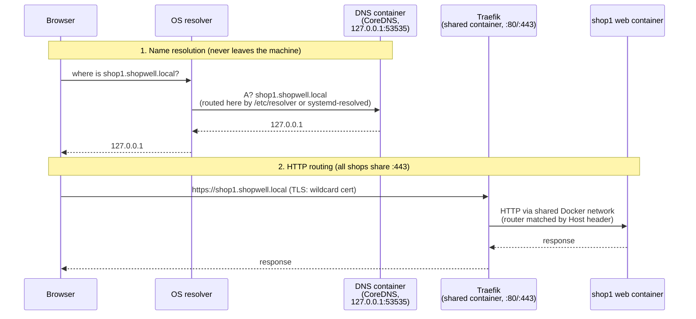
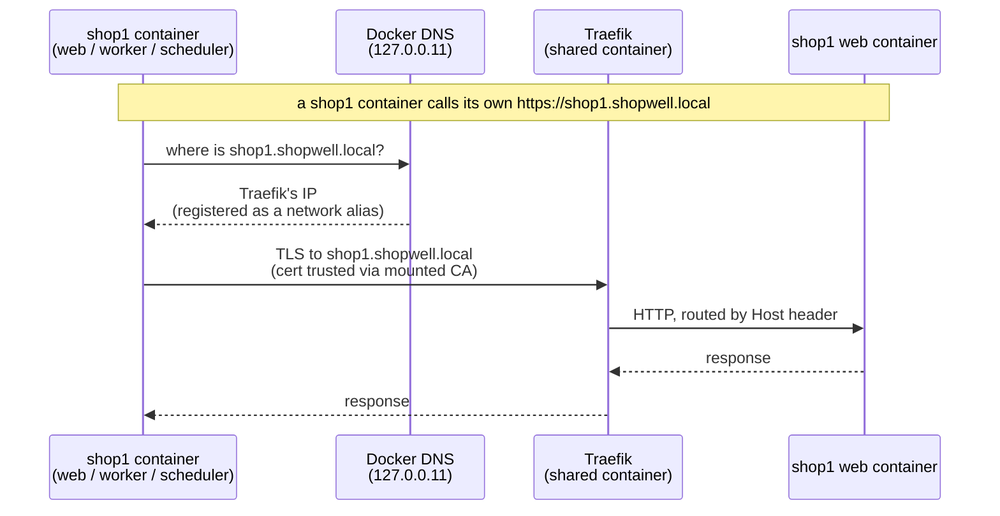

# Local proxy: run many shops at once

`shopwell-cli project proxy` lets any number of local Shopwell projects run at
the same time, each under a stable hostname like `https://shop1.shopwell.local`,
instead of everyone fighting over `127.0.0.1:8000`. This document explains how
it works and why it is built this way. It is accurate to the current
implementation (`internal/proxy/`, `cmd/project/project_proxy*.go`).

## TL;DR

- Every shop gets a hostname derived from its directory name:
  `~/Playground/shop1` → `https://shop1.shopwell.local`.
- One shared **Traefik** container routes by hostname, so shop containers
  publish **no host ports at all** — port conflicts disappear by construction.
- A small **DNS container (CoreDNS)** answers `*.shopwell.local → 127.0.0.1`.
  It runs the same way as the shared Traefik container — no DNS-server code to
  maintain — and no query leaves the machine.
- HTTPS works out of the box: a local CA (mkcert-compatible) signs a wildcard
  certificate; `proxy setup` trusts it once per machine.
- Shops can reach **each other** (and themselves) by hostname over HTTPS from
  inside their containers — same names, same certificate, no host involved.
- Everything `proxy up` changes is recorded and **restored exactly** by
  `proxy down`.

| Command | What it does |
| --- | --- |
| `proxy setup` | One-time machine setup: OS DNS routing + CA trust. The single sudo moment. `--domain`, `--skip-trust` |
| `proxy up` | Register the current project: start shared infra if needed, switch the shop to its hostname, start it |
| `proxy down` | Deregister: stop the shop, restore every changed value |
| `proxy list` / `status` | Show registered shops with their URLs / this project's state |
| `proxy verify` | Bottom-up health check of the whole chain, with fix hints |
| `proxy teardown` | `down` for every registered project, then stop shared infra (confirmable, `--force`) |

## Two ways a project uses the proxy

- **New projects** — pick **"Local domains: Yes"** in `project create` (or pass
  `--local-domain`). That writes the hostname into `.config/shopwell-project.yml`, and
  `project dev` then brings the shop up through the proxy automatically — no
  `proxy up` needed. Run `proxy setup` once per machine first (DNS + trust).
- **Existing port-based projects** — `proxy up` opts them in on demand (switching
  their URL to the hostname and remembering the old one), and `proxy down`
  reverts them exactly.

A project created with a local domain *is* a proxy project by identity, so
`proxy down` there has no port mode to return to — it just stops and
deregisters the shop (a later `project dev` re-bootstraps it). The exact-restore
behavior below applies to the opt-in (`proxy up`) case.

## `proxy setup` is the only sudo — agents need none

`proxy setup` is the single moment that needs `sudo`: it points the OS resolver
at the DNS container *and* installs the CA into the trust stores. Both need
root, and they run together in one ceremony, so a set-up machine always serves
**trusted HTTPS** — there is deliberately no "domains but no HTTPS" half-state
to opt into.

Because these are the only steps that touch the system, `proxy setup` (and the
inline setup offered by `project create`) asks first: it explains the two
changes and lets you pick **"set it up for me"** (it runs the `sudo` commands)
or **"I'll do it myself"** (it prints the exact resolver file and trust command
to run by hand). Non-interactively it never runs `sudo` unprompted — it prints
the steps and continues.

Everything else needs no root. Once a human has run `proxy setup` once on a
machine, `project create`, `project dev` (which bootstraps the proxy
automatically for a local-domain project) and `proxy up` all run **without
`sudo`**. So an agent on an already-set-up machine can bring any shop up at its
stable `https://…` hostname entirely on its own.

## The problem

The standard dev environment publishes fixed host ports (`8000`, `9080`,
`8025`, …). Fixed ports mean: second shop → port collision → stop the first
shop or edit ports by hand. Hostnames fix this only if two other problems are
solved: something must *resolve* the hostnames (DNS), and something must
*route* them to the right container (reverse proxy).

## How a request travels



Two deliberately separated responsibilities:

- **DNS is dumb.** The DNS container answers `127.0.0.1` for *anything*
  under the domain (wildcard) — it knows nothing about shops. That is why a
  new shop needs zero DNS changes.
- **Traefik is smart.** It watches the Docker socket and picks up routing
  rules from container labels. Which container answers is decided per request
  by the `Host` header.

### The DNS part in detail

DNS is served by a **CoreDNS container** (`internal/proxy/dns_container.go`),
run the same way as the shared Traefik container so there is no DNS-server code
to maintain — only a one-zone Corefile: A queries in the zone → `127.0.0.1`,
AAAA → empty NOERROR (prevents IPv6 fallback delays). It publishes UDP+TCP on
`127.0.0.1:53535` only — a high port bound to loopback, reachable from the host
but nothing else. `proxy up` starts it idempotently (like Traefik) with
`--restart unless-stopped`, so it comes back on its own after a reboot; a
container built for an older config or a different domain is recreated.

The OS is told to use it for exactly one domain (split DNS):

- **macOS**: a file `/etc/resolver/shopwell.local` (`nameserver 127.0.0.1`,
  `port 53535`),
- **Linux**: a systemd-resolved drop-in (`DNS=127.0.0.1:53535`,
  `Domains=~shopwell.local`).

Writing that config is the one operation that needs sudo, done once by
`proxy setup`. All other DNS traffic is untouched.

> **Hint:** Go's own resolver ignores `/etc/resolver` — that is why
> `proxy verify` checks resolution through `dscacheutil`/`getent` (the real OS
> path browsers use), not through `net.LookupHost`.

## What `proxy up` changes — and how `down` undoes it

This is the **opt-in** flow (`proxy up` on a port-based project); a project born
with a local domain skips the URL rewrites since the hostname is already its
configured URL.

A registered shop must not only be *reachable* under its hostname, it must
*believe* in it (Shopwell rejects unknown domains with a 400 page). So `up`
touches five things, records the old values, and `down` restores them exactly:

| Change | Where | Restored by `down` |
| --- | --- | --- |
| Traefik labels, no host ports, shared network, CA mount | `compose.yaml` (regenerated in proxy mode) | regenerated in fixed-port mode |
| `APP_URL=https://<host>` | `.env.local` (one-line surgical edit) | previous value from registry |
| Sales channel domain | database, via a parameterized `UPDATE` on the executor's DB connection | previous value (while the stack runs; otherwise a hint to restore it) |
| `url:` keys (top-level + environment) | resolved project configuration file (recommended `.config/shopwell-project.yml`; legacy paths preserved) | previous values; a previously absent key is removed again |
| Traefik network aliases | shared Traefik container | reconciled to the remaining hostnames |
| Registry entry | `<state dir>/registry.json` | entry removed |

Why proxy mode lives **in `compose.yaml`** rather than a separate
`compose.override.yaml`: `compose.yaml` is generated by shopwell-cli and
gitignored — it is ours to rewrite — whereas `compose.override.yaml` is left
for the user's own customizations (`docker compose` merges it automatically).
Proxy mode is just a variant of the generated file: `up`/`project dev`
regenerate it with proxy routing, `down` regenerates it with fixed ports.
Because the whole file is generated, proxy mode simply omits the host ports
instead of clearing them with a `!reset` tag — so there is **no Docker Compose
version requirement**. The database keeps its published loopback port in both
modes, so host tools (and the sales-channel URL update) still reach it. PaaS
projects (`shopwell/k8s-meta` in `composer.lock`) route RustFS at `s3.<host>`
(S3 API, used as `K8S_FILESYSTEM_PUBLIC_URL`) and `storage.<host>` (console).
PHP still talks to `storage:9000` on the compose network. The cache stays internal.

Why a direct database `UPDATE` for the sales channel domain instead of a
console command: it works on **every Shopwell version** (the core
`sales-channel:replace:url` command is 6.7+ only, and the older
`sales-channel:update:domain` keeps the previous port), and it reuses the
executor's database connection rather than shelling into a container.

> **Trade-off:** while a shop is registered, `.config/shopwell-project.yml` and
> `.env.local` show as modified in git. That is intentional — the dev TUI and
> the admin API client read the URL from those files — but don't commit the
> proxy URLs. `down` cleans them up.

## HTTPS

- The CA is created by code adapted from **mkcert** (`internal/mkcert/`,
  BSD-licensed; mkcert itself is `package main` and cannot be imported). It
  lives in mkcert's standard CAROOT and uses mkcert's format — **anyone who
  ever ran `mkcert -install` is already trusted with zero prompts**, and
  certificates from either tool are interchangeable.
- `proxy up` maintains one server certificate. TLS wildcards match a single
  label, so `*.shopwell.local` covers `shop1.shopwell.local` but **not**
  `mailer.shop1.shopwell.local` — every registered project contributes a
  `*.<project>.shopwell.local` SAN and the certificate is regenerated when the
  set changes. Traefik watches the cert files and reloads without restart.
- Trust installation (`proxy setup`) uses the `smallstep/truststore` library
  (the maintained port of mkcert's trust-store code, also used by Caddy):
  system keychain / CA directory, plus best-effort NSS for Firefox.
- **Degraded mode is fine:** with `--skip-trust` (or a blocked trust store)
  everything still works — browsers just show a click-through warning.
  Firefox can import the CA per-user without admin rights.

## Reaching the shop from inside its own containers

Everything above is about the **browser on the host** reaching a shop. But the
shop's containers also call the shop's **own `APP_URL`** — a shop registering
an app and receiving the confirmation callback, the sitemap generator fetching
its own URL, the message queue worker running a flow action that hits the API.
Once `APP_URL` is `https://shop1.shopwell.local`, those calls originate *inside*
a container and by default fail twice: the hostname does not resolve there
(containers use Docker's own DNS, not the host's `/etc/resolver`), and even if
it did, the container's trust store does not know the proxy CA.

So the goal here is **self-reachability**: a container calling the shop's own
URL is routed back to the shop over the exact URL and certificate the browser
uses.



- **Resolution** — every registered hostname is added as a **network alias of
  the shared Traefik container** (`ReconcileHostnames`). A shop container
  resolving `shop1.shopwell.local` via Docker's embedded resolver gets
  Traefik's address and is routed by `Host` back to the shop, identical to
  host-side traffic. Reconciled on `up`/`down`, only when the set actually
  changed (no needless network flap).
- **Trust** — a combined CA bundle (the image's own public CAs plus the proxy
  CA) is mounted read-only **over the container's system trust store**
  (`/etc/ssl/certs/ca-certificates.crt`), so PHP, curl and — via
  `NODE_EXTRA_CA_CERTS` — Node all trust the proxy certificate immediately,
  while still trusting the public internet. Mounting the bare CA under
  `/usr/local/share/ca-certificates/` would not work: the image runs as
  `www-data` and never runs `update-ca-certificates`.

The web, worker and scheduler containers all join the shared network and carry
the bundle, so a self-call works whether it originates from a request, the queue
worker, or a scheduled task — including Shopwell's own `APP_URL` reachability
check, which curls the shop over HTTPS.

> **Nice side effect — cross-shop:** because all registered hostnames are
> aliased on the one shared Traefik, a container in one shop can also reach
> *another* registered shop by its hostname over the same TLS (e.g. one shop
> acting as an app backend for another). This falls out of the design for
> free; it is not the primary goal. A shop that is registered but not running
> resolves to Traefik and gets a 404 (no live route) — the expected "not up"
> signal, not a crash.

## Design decisions and their trade-offs

| Decision | Why | Trade-off |
| --- | --- | --- |
| Embedded local DNS instead of a public wildcard domain (`*.sslip.io`-style) | Works offline; immune to DNS-rebind protection in routers/corporate resolvers (they drop public answers pointing at `127.0.0.1`); project names never leak to a public DNS service | One-time `setup` with sudo; a corporate VPN agent that hijacks OS DNS can interfere (diagnosed by `verify`) |
| No automatic `/etc/hosts` editing | It would be a second, confusing mechanism; the CLI should not silently edit a system file it does not own | On Linux without systemd-resolved, wildcard DNS is impossible — the CLI explains why, how to enable systemd-resolved, and offers manual hosts lines as last resort |
| Base domain `shopwell.local`, changeable via `proxy setup --domain` (persisted machine-wide) | One setting all commands read; per-command flags would let resolver, certs and registry drift apart | `.local` is technically mDNS territory (RFC 6762); macOS conflicts are rare but real — the `verify` hint suggests switching to e.g. `shopwell.internal` if resolution misbehaves |
| Traefik state dir mounted at `/shopwell-cli`, not `/etc/traefik` | Traefik silently prefers a `traefik.yml` found in `/etc/traefik` over **all** CLI flags — a stray file there once disabled our config invisibly | None; the path is referenced explicitly everywhere |
| `golang.org/x/net/dns/dnsmessage` instead of `miekg/dns` | miekg/dns v1 is in maintenance mode, v2 is unstable until ~2028; `x/net` is Go-team maintained and was already in the dependency graph | ~80 extra lines of hand-written (fully tested) UDP/wire-format code |
| Shared infra is lazy (`up` starts it), not a system service | No launchd/systemd units to install/uninstall; nothing runs when no shop does | After a reboot, the first `proxy up` brings infra back — shops don't auto-start |
| `teardown` deregisters **all** projects first (with confirmation / `--force`) | Stopping only the infra would strand running shops on dead hostnames and leave their URLs broken | A *stopped* shop's database is unreachable, so its sales-channel URL is not restored until it next runs (the CLI prints a reminder) |

## State the CLI writes

| Location | Content |
| --- | --- |
| `~/Library/Application Support/shopwell-cli/proxy/` (macOS) / `~/.config/shopwell-cli/proxy/` (Linux) | `registry.json` (registered projects + remembered previous values), `settings.json` (domain), `dns/Corefile` (CoreDNS zone config), `traefik/certs/` + `traefik/dynamic/` (server cert, watched Traefik config) |
| mkcert CAROOT (e.g. `~/Library/Application Support/mkcert/`) | `rootCA.pem`, `rootCA-key.pem` — shared with mkcert |
| `/etc/resolver/<domain>` or `/etc/systemd/resolved.conf.d/90-shopwell-cli.conf` | OS split-DNS routing (sudo, written by `setup`, removed on domain change) |
| Per project | `compose.yaml` (regenerated in proxy mode, incl. the read-only CA mount), `APP_URL` in `.env.local`, `url:` in `.config/shopwell-project.yml` — all reverted by `down` |

## When something is wrong

Run `shopwell-cli project proxy verify`. It checks the chain bottom-up —
Docker → DNS container answers → **OS actually routes to it** → Traefik on
:443 → trusted HTTPS against `https://proxy.<domain>/ping` — and stops at the
first broken layer with a plain-language hint (including what to ask an IT
team when sudo is blocked, and likely causes such as VPN DNS interception).
Every failure mode the messages describe is unit-tested.

## Running under WSL2

shopwell-cli runs inside the WSL distro, but your **browser runs on Windows** — a
different OS with its own DNS resolver and its own certificate trust store. The
proxy setup only configures the Linux side, so two things need manual, one-time
attention. The CLI detects WSL and prints the exact copy-pasteable commands at the
end of `proxy setup`, `proxy up` and `project create`; this section explains why.

### 1. DNS inside WSL

`proxy setup` writes the systemd-resolved drop-in as on any Linux, and
systemd-resolved answers `*.shopwell.local` correctly (check with
`resolvectl query test.shopwell.local`). But **`getent` — the path `proxy verify`
and browsers use — does not ask resolved**: WSL keeps `/etc/resolv.conf` pointing
at the WSL NAT gateway (`172.x`), and the default `nsswitch.conf` sends `getent`
straight there, bypassing resolved. So `*.shopwell.local` fails to resolve even
though resolved knows it.

The fix is to add resolved to `nsswitch.conf` **as a fallback** — *after* `dns`,
never before it. On WSL resolved only knows `*.shopwell.local` (it has no
internet upstream of its own), so putting it first would break internet DNS; as
a fallback it is only consulted for names the gateway cannot resolve:

```bash
sudo apt-get install -y libnss-resolve
# Append `resolve` as the LAST source on the existing hosts line, preserving
# whatever sources (files, dns, mymachines, …) are already configured.
sudo sed -i -E '/^hosts:/{/\bresolve\b/!s/[[:space:]]*$/ resolve/}' /etc/nsswitch.conf
```

Verify: `getent hosts test.shopwell.local` returns `127.0.0.1`, and
`getent hosts one.one.one.one` still resolves (internet intact).

> Do **not** symlink `/etc/resolv.conf` to systemd-resolved's stub on WSL: with no
> internet upstream on the link, resolved would `NXDOMAIN` every non-`.shopwell.local`
> name and break DNS. Leaving `resolv.conf` at the `172.x` gateway and adding the
> nsswitch fallback keeps both working.

### 2. Reaching the shop from the Windows browser

Windows does not use WSL's resolver or trust store, so a browser on Windows needs
two things the CLI cannot do from inside the subsystem (it prints them via
`WSLWindowsAccessGuidance`):

- **Trust the CA.** In WSL, copy the CA out to Windows:
  ```bash
  cp ~/.local/share/mkcert/rootCA.pem /mnt/c/Users/Public/shopwell-cli-rootCA.pem
  ```
  Then, in a Windows terminal opened **as Administrator**, import it:
  ```
  certutil -addstore -f ROOT C:\Users\Public\shopwell-cli-rootCA.pem
  ```
  `~/.local/share/mkcert/rootCA.pem` is the default CA location; if you set
  `CAROOT`, use that directory instead (the CLI prints the exact path). `C:\Users\Public`
  is world-accessible so the commands carry no username. Chrome and Edge use the
  Windows store; Firefox needs its own import or
  `security.enterprise_roots.enabled = true`. Restart the browser after.
- **Resolve the hostnames.** Windows has no split-DNS to the DNS container, so
  add the shop's hostnames to the Windows hosts file (no wildcards, so every
  subdomain sits on one line), editing it **as Administrator**:
  ```
  # C:\Windows\System32\drivers\etc\hosts
  127.0.0.1 shop1.shopwell.local admin-watch.shop1.shopwell.local storefront-watch.shop1.shopwell.local adminer.shop1.shopwell.local mailer.shop1.shopwell.local
  ```
  `proxy up` prints this exact line for the current shop, including any
  `queue`/`search`/`s3`/`storage` subdomains the project uses.

The CA import is one-time per machine; the hosts line is per shop.

## Known limitations

- **Native Windows is not supported** — the proxy's DNS and resolver wiring are
  macOS/Linux only (the Windows stubs return a clear error, and the rest of the
  CLI still compiles and runs there). On Windows, run it **inside WSL2**: the CLI
  sets up the Linux side automatically, and the two manual steps above let a
  browser on Windows reach the shops.
- Requires the Docker-based dev environment.
- One `sudo` interaction per machine (`proxy setup`); on corporate machines
  with blocked sudo the CLI prints exact hand-over instructions for IT.
- Auxiliary services keep working through subdomains (`mailer.shop1…`,
  `adminer.shop1…`); their raw ports (management/UI) are not published in proxy
  mode — use `docker compose exec` for direct access. The database is the
  exception: it keeps a random published loopback port in both modes. PaaS
  stacks route the S3 storage at `s3.<host>` / `storage.<host>` so media URLs stay
  HTTPS on the local domain. Redis is compose-internal only.
- Only the shop's **root** hostname is aliased for in-container use — service
  subdomains (`mailer.…`) are host/browser-facing.
- **Changing the admin-worker setting while a shop is proxied can orphan the
  worker/scheduler containers.** `down` regenerates `compose.yaml` from the
  current config; if the dedicated worker/scheduler no longer belong there,
  `docker compose down` does not know to stop the already-running ones. It is
  an edge (no normal flow flips that mid-lifecycle); `docker compose down
  --remove-orphans` clears it.
- **Dev watchers (`admin-watch`, `storefront-watch`) are not wired end-to-end.**
  Traefik routes the subdomains and proxies websockets, but Vite's HMR client
  URL and `allowedHosts` must point at the proxy hostname — that config lives
  in `docker-dev` / the Vite setup, so it is a separate, cross-repo workstream.
- **WSL2 needs manual Windows-side steps.** Native Windows is a clean "not
  supported". WSL2 works, but because the daemon runs in the distro and the
  browser runs on Windows, it needs one-time manual wiring: a systemd-resolved
  fallback in `nsswitch.conf` so `getent` resolves `*.shopwell.local`, plus the
  CA and hostnames on the Windows side. The CLI detects WSL and prints the exact
  steps — see "Running under WSL2".
